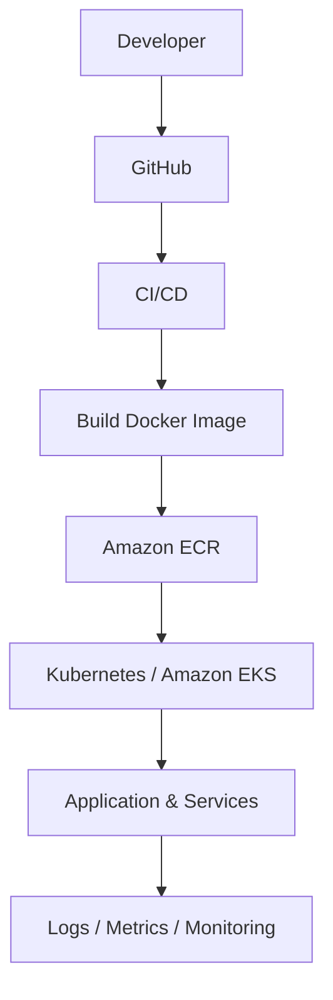
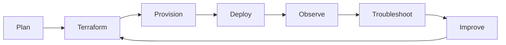

# Ajeet Dubey

### Senior DevOps Engineer | Cloud Infrastructure | Kubernetes | Automation

**AWS** · **Azure** · **Amazon EKS** · **Kubernetes** · **Terraform** · **Docker** · **CI/CD** · **Linux** · **Cloud Security** · **Observability**

[](https://github.com/ajeet-dubey89)
[](https://www.linkedin.com/in/ajeet-dubey89/)

---

## `$ whoami`

I am a **Senior DevOps Engineer** focused on designing, automating, securing, and operating cloud infrastructure and containerized platforms.

My engineering work spans **AWS and Azure**, with hands-on focus around **Kubernetes/Amazon EKS, Infrastructure as Code, CI/CD, Linux administration, cloud security, monitoring, and production troubleshooting**.

I enjoy turning operational problems into repeatable engineering solutions — from infrastructure provisioning and deployment automation to Kubernetes troubleshooting, security hardening, backup automation, and observability.

> **Build it → Automate it → Secure it → Observe it → Troubleshoot it → Improve it**

---

## `$ engineering-focus`

```text
┌─────────────────────────────────────────────────────────────────────┐
│                        DEVOPS ENGINEERING                           │
├──────────────────────┬──────────────────────┬───────────────────────┤
│ CLOUD                │ PLATFORM             │ AUTOMATION            │
│ AWS / Azure          │ Kubernetes / EKS     │ Terraform / IaC        │
│ Networking           │ Docker               │ CI/CD                  │
│ Compute              │ Containers           │ GitHub Actions         │
│ Storage              │ Services / Ingress   │ Jenkins                │
│                      │                      │ CodePipeline / Build   │
├──────────────────────┼──────────────────────┼───────────────────────┤
│ SECURITY             │ OBSERVABILITY        │ OPERATIONS             │
│ IAM / KMS            │ CloudWatch           │ Linux                  │
│ WAF                  │ Site24x7             │ Bash / Python / CLI    │
│ GuardDuty            │ Logs / Metrics       │ Incident Analysis      │
│ Security Hub         │ Alert Investigation  │ Backup / Recovery      │
│ Inspector            │ Troubleshooting      │ Automation              │
└──────────────────────┴──────────────────────┴───────────────────────┘
```

---

## `$ cloud-stack`

### AWS

`EC2` · `EKS` · `S3` · `CloudFront` · `ALB` · `NLB` · `Route 53` · `RDS` · `Aurora` · `DynamoDB` · `ElastiCache` · `ECR` · `Lambda` · `CloudWatch` · `Secrets Manager` · `KMS` · `SNS` · `SQS` · `WAF` · `GuardDuty` · `Security Hub` · `Inspector`

### Azure

`Virtual Machines` · `VM Scale Sets` · `Application Gateway` · `NSG` · `Azure SQL` · `Azure Storage` · `Azure Cache for Redis` · `Private Endpoints` · `VNet`

---

## `$ platform-engineering`

### Kubernetes & Containers

- Kubernetes
- Amazon EKS
- Docker
- Deployments and Services
- Ingress
- ConfigMaps and Secrets
- Resource requests and limits
- Pod lifecycle troubleshooting
- Container restart analysis
- Kubernetes upgrades
- Production workload troubleshooting

### Infrastructure as Code

- Terraform
- Modular infrastructure design
- Environment-based infrastructure
- AWS networking and compute
- Kubernetes infrastructure
- Repeatable provisioning
- Infrastructure change planning

### CI/CD

- Jenkins
- GitHub Actions
- AWS CodePipeline
- AWS CodeBuild
- Amazon ECR
- Container build and deployment workflows
- Deployment troubleshooting
- CI/CD operational maintenance

---

## `$ security`

I treat security as part of infrastructure engineering rather than a separate afterthought.

### Security areas

`IAM` · `KMS` · `Secrets Manager` · `WAF` · `Security Groups` · `NSG` · `GuardDuty` · `Security Hub` · `Inspector`

### Public repository rules

```text
NO SECRETS
NO ACCESS KEYS
NO PRIVATE KEYS
NO PRODUCTION CREDENTIALS
NO REAL CUSTOMER DATA
```

Public projects should use safe examples, environment variables, placeholders, and documented secret-management patterns.

---

## `$ observability`

### Monitoring & Operations

- AWS CloudWatch
- Site24x7
- Application and infrastructure monitoring
- Log analysis
- Resource utilization analysis
- Alert investigation
- Production troubleshooting
- Disk utilization analysis
- Application response-time investigation

### Troubleshooting mindset

```text
Symptom
   ↓
Collect evidence
   ↓
Reproduce / isolate
   ↓
Identify root cause
   ↓
Apply controlled fix
   ↓
Validate
   ↓
Document
   ↓
Prevent recurrence
```

---

## `$ architecture`

### Typical cloud delivery flow



### Infrastructure engineering lifecycle



---

## `$ projects`

The goal of this profile is to showcase **proof of engineering**, not simply a list of technologies.

Projects below are the planned structure for the public portfolio. Repository status should reflect the actual implementation state.

### 01 · AWS EKS Platform

**Repository:** `eks-terraform-platform`

A hands-on Kubernetes platform demonstrating infrastructure provisioning, EKS architecture, networking, container workloads, deployment automation, and operational documentation.

**Focus**

`Terraform` · `AWS` · `EKS` · `Kubernetes` · `VPC` · `ECR` · `Load Balancing` · `IAM` · `Observability`

**Project evidence**

- Architecture diagram
- Terraform structure
- Kubernetes manifests
- Deployment workflow
- Security considerations
- Validation steps
- Cleanup procedure

---

### 02 · Terraform AWS Infrastructure

**Repository:** `terraform-aws-infrastructure`

Reusable AWS infrastructure examples covering networking, compute, storage, security, and data services.

**Focus**

`VPC` · `Subnets` · `Routing` · `Security Groups` · `IAM` · `EC2` · `S3` · `RDS` · `Terraform Modules`

---

### 03 · CI/CD Engineering Lab

**Repository:** `github-actions-cicd`

A practical CI/CD implementation showing the path from source code to container image and deployment.

```text
Git Push
   │
   ▼
Validate → Test → Build
   │
   ▼
Docker Image
   │
   ▼
Amazon ECR
   │
   ▼
Kubernetes / EKS
   │
   ▼
Observe → Validate
```

**Focus**

`GitHub Actions` · `Docker` · `Amazon ECR` · `Kubernetes` · `Deployment Automation` · `Secrets Handling`

---

### 04 · Kubernetes Troubleshooting Lab

**Repository:** `kubernetes-troubleshooting-lab`

A practical collection of reproducible Kubernetes failure scenarios.

**Scenarios**

- CrashLoopBackOff
- OOMKilled
- ContainerStatusUnknown
- Failed deployments
- Missing Secret keys
- Resource pressure
- Image pull failures
- Service / Ingress troubleshooting
- Pod restart investigation

Each scenario follows:

```text
Failure
  ↓
Evidence
  ↓
kubectl Investigation
  ↓
Root Cause
  ↓
Resolution
  ↓
Prevention
```

---

### 05 · Cloud Security Lab

**Repository:** `cloud-security-lab`

Hands-on cloud security demonstrations using safe, non-production examples.

**Focus**

`IAM` · `KMS` · `WAF` · `GuardDuty` · `Security Hub` · `Inspector` · `Secrets Management` · `Logging`

---

## `$ troubleshooting`

Production infrastructure rarely fails in a clean, predictable way.

My approach is evidence-driven.

### Kubernetes

```bash
kubectl get pods -A
kubectl describe pod <pod>
kubectl logs <pod> --previous
kubectl get events -A --sort-by=.lastTimestamp
kubectl get deployment <deployment> -o yaml
kubectl top pods
kubectl top nodes
```

### Linux

```bash
df -h
du -xh /var | sort -h
free -m
uptime
ps aux --sort=-%mem
ps aux --sort=-%cpu
ss -tulpn
journalctl -xe
```

### AWS

```bash
aws sts get-caller-identity
aws eks describe-cluster --name <cluster>
aws ec2 describe-instances
aws s3 ls
aws logs describe-log-groups
```

The objective is not simply to execute commands.

It is to **collect evidence, isolate the failure domain, understand the dependency chain, and validate the fix**.

---

## `$ repository-standard`

Every serious project in this profile should document:

```text
01. Problem
02. Architecture
03. Technology choices
04. Repository structure
05. Prerequisites
06. Deployment
07. Security
08. Observability
09. Troubleshooting
10. Validation
11. Cleanup
12. Lessons learned
```

This keeps repositories useful to both engineers and recruiters.

---

## `$ portfolio`

### DevOps Engineering Portfolio

**Portfolio:** `ajeet-dubey89.github.io`

The portfolio will extend this GitHub profile rather than duplicate it.

```text
HOME
 │
 ├── Engineering Identity
 │
 ├── Cloud / Platform Stack
 │
 ├── Featured Projects
 │
 ├── Architecture
 │
 ├── Troubleshooting Case Studies
 │
 ├── Infrastructure & Security
 │
 ├── Resume
 │
 └── Contact
```

### Visual direction

A modern **cloud infrastructure / terminal console** aesthetic:

- Dark engineering interface
- Clean typography
- AWS / Azure / Kubernetes architecture visuals
- Interactive project cards
- Architecture diagrams
- Incident and troubleshooting case studies
- Responsive design
- Fast static delivery
- Accessibility-first interactions

---

## `$ engineering-principles`

```text
Infrastructure as Code
        +
Automation
        +
Security
        +
Observability
        +
Documentation
        +
Continuous Improvement
        =
Reliable Engineering
```

I value systems that are:

- Repeatable
- Observable
- Secure
- Documented
- Automatable
- Recoverable
- Easy to troubleshoot

---

## `$ currently-building`

This profile is being developed as a **living engineering portfolio**.

Planned areas include:

- Terraform infrastructure
- Kubernetes labs
- EKS platform examples
- CI/CD workflows
- Cloud security demonstrations
- Troubleshooting playbooks
- Architecture diagrams
- Automation scripts
- Production-inspired case studies

> **Real implementation and technical evidence over inflated project counts.**

---

## `$ connect`

**GitHub:** https://github.com/ajeet-dubey89  
**LinkedIn:** https://www.linkedin.com/in/ajeet-dubey89/

---

### `EOF`

> **Build systems. Automate operations. Secure infrastructure. Learn from failures.**
